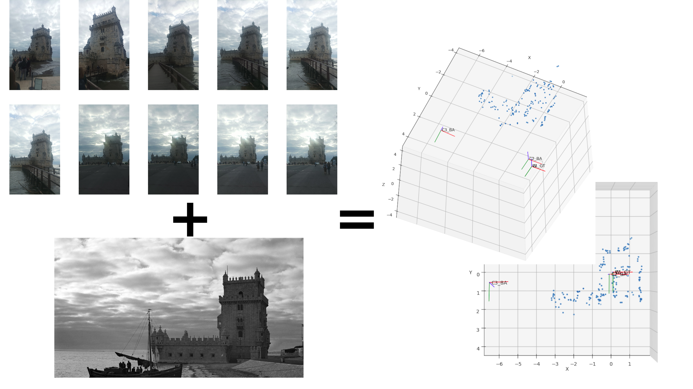

# ComputerVision-Inator: Final project for the Computer Vision course at MRGCV

My code for the final course assignment within the Computer Vision subject at MRGCV (Master's in Robotics, Graphics and Computer Vision), taught at Universidad de Zaragoza (Spain) during the 2023-2024 course, using OpenCV, Python and SuperGlue. This project was graded 9.5 out of 10.

## You can read the report (2 pages long) [here](https://github.com/PedroPerez14/ComputerVision-Inator/blob/master/report_and_slides/Computer_Vision_Course_Assignment_Report.pdf)!
## The slides for the project presentation can be found [here](https://github.com/PedroPerez14/ComputerVision-Inator/blob/master/report_and_slides/Computer%20Vision%20Course%20Assignment.pdf)!



## Goal of the assignment
This course assignment had two main goals:
1. Compute a precise localization (position + orientation) of the camera that took an old photo (before 1990) of a relevant building or landmark, using a set of recent images taken with a regular smartphone camera.
2. Determine the changes and differences between both pictures in a visual manner.

Additionally, the processing should be as automatic as possible, thus this implementation based on config files.

## Provided example images
You will be able to find some pictures in this repo, those are the images I used for my original project. They were taken around March 2023 during my Erasmus stay in Lisbon. I provide them to allow for quick testing in case anyone downloads this code. They belong to the Tower of Belém, in Lisbon. The corresponding historical picture is dated around 1930, presenting a higher difficuty for matching when compared to newer pictures.

# How to use
## Setting up the Conda environment

First of all, you will need to set up the package dependencies. In order to ease up the process, a yaml file that lists the dependencies is provided to create a conda environment. To do so, execute the following commands in a terminal (Only tested in Ubuntu):
```shell
conda env create -f CVISEnv.yaml
```

To activate the environment:

```shell
conda activate CVISEnv
```

To deactivate it:

```shell
conda deactivate
```

## Running the code
The main code for the project is located in the ```scripts``` folder. The entire pipeline can be run from the ```master_script.py```script.
This script is divided in two functions, pose estimation from the old and new pictures and image difference. The pose estimation step has been divided in four sub-steps, allowing for separate executions, or executing arbitrary steps of the process. Each step produces files that will be read by the subsequent steps. Logically, a step can only be executed if the previous step generated any output. 
As an example, a complete set of intermediate and final results is provided here.

Additionally, the names of the intermediate files and their expected read/write locations are controlled from the ```scripts/config.ini```file. You should modify it according to your needs.
For more detail on the working of the 4 stages of the camera estimation mode, please check the report.

### Help command
```shell
cd scripts
master_script.py -h
```
### Running the camera estimation mode:
```shell
cd scripts
python master_script.py old_camera_estimation [-h -c <CONFIG_FILE> -s <STAGE(S)>]
# Example: python master_script.py old_camera_estimation -c config.ini -s 1,4
# The stages should be in order and separated by a comma with no spaces ideally
```
### Running the image difference mode:
```shell
cd scripts
python master_script.py image_diff [-h] -i1 <NEW_IMAGE_PATH> -i2 <OLD_IMAGE_PATH>
# Example: python master_script.py image_diff -i1 ./wasd.png --img2 ./hello.png
```

# License and rights
 
A copy of the license provided by the SuperGlue development team for their matching demo code is included in its respective folder.
The rights of the example pictures belong to me, but can be used for non-profit (research and testing) purposes. If in doubt, just ask.
The rest of the code can be used freely as you wish. If you are a student of the MRGCV master's degree, first of all, good luck :) Secondly, use whatever of this code you deem moral and appropiate.
For other questions that might fall outside what has been stated here, check the LICENSE file.
